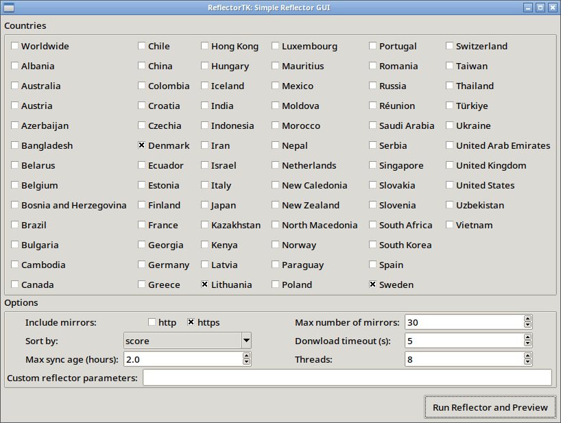

# ReflectorTK
[](LICENSE)
> Simple graphical interface for Arch Linux's `reflector` (`pacman` mirrorlist generator).

ReflectorTK provides a straightforward graphical interface for configuring and running the `reflector` to update Arch Linux's mirrorlist. This program is a TKinter-based drop-in replacement for [`reflector-simple`](https://github.com/endeavouros-team/PKGBUILDS/tree/master/reflector-simple) GUI shipped with EndeavourOS.



## Operation

- Reads system `reflector` configuration (`/etc/xdg/reflector/reflector.conf`) and user configuration (`~/.config/reflectortk/reflectortk.ini`).
- Presents available countries and some basic `reflector` options in a GUI.
- Runs the `reflector` command.
- Shows a preview of the generated mirrorlist.
- Saves the new mirrorlist to the system default (`/etc/pacman.d/mirrorlist`) using `pkexec` (backing up the old one) or to a custom location.

## Rationale: Why recreate `reflector-simple`?

1.  **Dependency bloat:** `reflector-simple` uses [`yad`](https://github.com/v1cont/yad) for its graphical interface, which pulls in the `webkit2gtk-4.1` as a hard dependency. In author's case, `reflector-simple` was the *only* program requiring `yad` and thus `webkit2gtk`, wasting ~126MB of disk space.
2.  **Python availability:** `reflector` is written in Python, meaning any system using it already has Python installed. This allows leveraging the existing environment, avoid dependencies, and potentially integrate the GUI with the original `reflector`.
3. **Better maintainability**: Python vs Bash (subjective). 

The initial goal was to set an experiment and recreate the original bash logic of `reflector-simple` in Python. The results are mixed: While I had anticipated a reduced line count, the results are opposite: a ~30% increase (~1190 vs 914). However, considering the bulk of code deals with replacing interaction with the purpose-built `yad` with a GUI based on the clunky TKinter API, doing away with dependencies in the process, this could be seen as a win. The origin also explains why ReflectorTK intentionally interacts with `reflector` by parsing its output instead of using it as a Python module.

Fun fact: I don't use `reflector-simple` and didn't know it existed until I noticed that's what pulls bulky updates.

## Requirements

*   Python 3 (with the standard `tkinter` module). No third-party Python libraries are required.
*   `reflector`
*   `polkit` which provides `pkexec` for saving to the system default path.

## Installation

ReflectorTK is available at the [AUR repository](https://aur.archlinux.org/packages/reflectortk-git) for Arch Linux and its derivative distros. Install with your favourite AUR helper, such as [pakku](https://github.com/zqqw/pakku), paru or yay.

```bash
pakku -S reflectortk-git
```

Or download the PKGBUILD file and install with makepkg:

```bash
git clone https://aur.archlinux.org/reflectortk-git.git
cd reflectortk-git
makepkg -si
```

Or just clone this repository directly and run:

```bash
git clone https://github.com/indiscipline/reflectortk.git
cd reflectortk
chmod +x reflectortk.py
```

## Usage

1.  **Launch the GUI:**
    ```bash
    # Make sure it's executable (`chmod +x reflectortk.py`)
    ./reflectortk.py
    # Or with Python:
    python reflectortk.py
    ```
2.  **Configure:** Initially, ReflectorTK loads system config from `/etc/xdg/reflector/reflector.conf` and updates it with user preferences loaded from  `~/.config/reflectortk/reflectortk.ini`. Current settings are saved on program exit.
3.  **Run & Preview:** the button does its thing.
4.  **Save:** A preview window will show the generated mirrorlist.
    *   **"Save to /etc/pacman.d/mirrorlist"** asks for authentication to save the list with elevated privileges. The existing mirrorlist is backed up to `/etc/pacman.d/mirrorlist.bak`.
    *   **"Save As..."** saves to a custom location.

## TODO:

- [x] Publish to AUR.
- [ ] Rewrite leveraging `reflector` as a Python module.
- [ ] Propose merging with upstream [`reflector`](https://xyne.dev/projects/reflector/) (that's why ReflectorTK is GPLv2).

## Contributing

Contributions are welcome! If you have bug fixes, improvements, or feature ideas, please open an issue first.

## License

ReflectorTK is licensed under the GNU General Public License version 2.0 or later; see the `LICENSE` file for full details.
